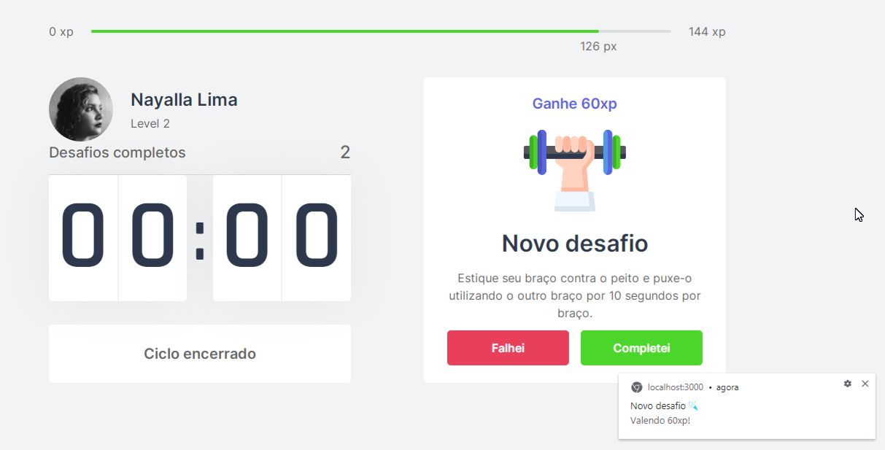

<h1 align="center"> Shake_DoWhile</h1>

  
  <a href="#-projeto">Projeto</a>&nbsp;&nbsp;&nbsp;|&nbsp;&nbsp;&nbsp;
  <a href="#-tecnologias-utilizadas">Tecnologias utilizadas</a>&nbsp;&nbsp;&nbsp;|&nbsp;&nbsp;&nbsp;
  <a href="#-layout">Layout</a>&nbsp;&nbsp;&nbsp;|&nbsp;&nbsp;&nbsp;
  <a href="#-pre-requisitos">Pré-requisitos</a>&nbsp;&nbsp;&nbsp;|&nbsp;&nbsp;&nbsp;
  <a href="#-contribuidores">Contribuidores</a>&nbsp;&nbsp;&nbsp;|&nbsp;&nbsp;&nbsp;
  <a href="#-licença">Licença</a>

## 💻 Projeto

O Shake é um app que une a técnica de Pomodoro com a realização de exercícios físicos para quem passa muito tempo na frente do computador.

## ✅ Tecnologias utilizadas

- [React](https://reactjs.org)
- [Next.js](https://nextjs.org/)
- [TypeScript](https://www.typescriptlang.org/)

## 🔖 Layout

Você pode visualizar o layout do projeto através [desse link](https://www.figma.com/file/ge20pu3ofMOKoliUyKx1Nl/Move.it-1.0). É necessário ter conta no [Figma](http://figma.com/) para acessá-lo.

## 📎 Pré-requisitos

- Clone o repositório
- Instale as dependências com `yarn`
- Inicie o servidor com `yarn dev`

Agora você pode acessar [`localhost:3000`](http://localhost:3000) do seu navegador.

## ♥️ Contribuidores 

 Obrigada a todos que fazem parte da <a href="http://campinas.tech/campinas-tech-talents/">Rocketseat 🚀</a>, 

## 🔒 Licença

---

Feito com 💜️ por Nayalla Lima
 
Entre em contato 😀 

